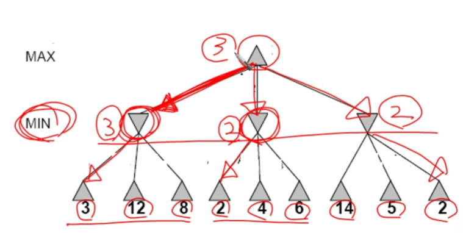
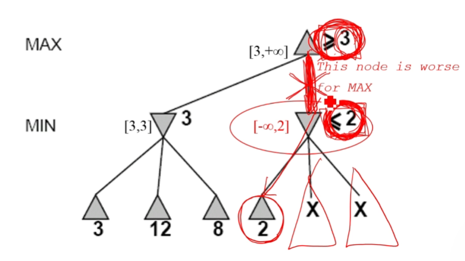
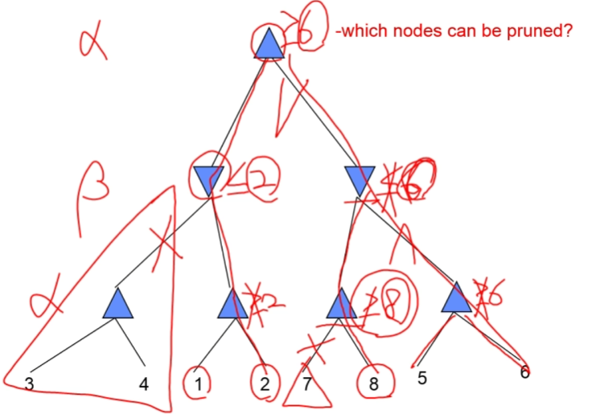
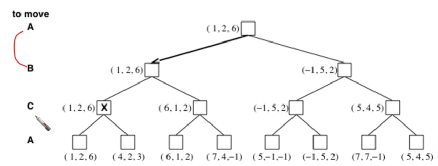

# Adversarial Search and Game-Playing

이 문서는 두 명의 플레이어가 서로의 이익이 상충하는 환경에서 최적의 수를 찾기 위한 인공지능 기법인 적대적 탐색에 대해 설명합니다. 

## 1. 개요 (Overview)

적대적 탐색은 주로 게임 플레이에 사용되며, 다음과 같은 특징을 가집니다.

### 일반적인 가정 (Typical assumptions) 
* 두 명의 에이전트(플레이어)가 번갈아 가며 행동합니다. 
* 한 에이전트의 효용(utility) 값은 다른 에이전트와 정반대입니다.  즉, 한 플레이어의 효용이 증가하면 다른 플레이어의 효용은 감소합니다. 
* 이러한 속성은 적대적인 상황을 만들어냅니다. 

### 게임 이론적 속성 (Properties in game theory) 
* **결정론적 (Deterministic)**: 모든 행동의 결과는 예측 가능합니다. 
* **순차적 행동 (Turn-taking)**: 두 플레이어가 반드시 번갈아 가며 행동합니다. 
* **제로섬 게임 (Zero-sum games)**: 한 플레이어가 +1을 얻어 이기면, 다른 플레이어는 반드시 -1을 얻어 패배합니다 (예: 체스). 
* **완전 정보 게임 (Perfect information)**: 현재 게임의 모든 상태를 완전히 관찰할 수 있습니다. 

## 2. 게임을 검색 문제로 정의하기 (Defining Games as Search Problems)

게임은 일종의 검색 문제로 모델링될 수 있지만, 일반적인 검색 문제와는 차이가 있습니다. 

| 구분 | 일반 검색 (Just Search) | 게임 (Games) |
|---|---|---|
| **해결책** | 목표에 도달하는 경로 또는 방법  | 상대방의 모든 가능한 대응에 대한 수를 지정하는 전략  |
| **최적해** | 휴리스틱 기법으로 최적의 해결책을 찾을 수 있음  | 시간제한으로 인해 근사적인 해결책을 찾는 경우가 많음  |
| **평가 함수** | 시작부터 특정 노드를 거쳐 목표까지의 비용 추정치  | 게임 상태의 "좋음"을 평가하는 효용 함수  |
| **예시** | 길 찾기, 8-퍼즐  | 체스, 체커, 오델로, 바둑  |

### 게임 검색의 4가지 요소 
1.  **초기 상태 (Initial state)**: 게임 시작 시의 배치 (예: 체스의 초기 기물 배치) 
2.  **후속 함수 (Successor function)**: 현재 게임 상태에서 가능한 모든 합법적인 수의 목록 
3.  **종료 테스트 (Terminal test)**: 게임이 끝났는지 여부 
4.  **효용 함수 (Utility function)**: 종료 상태의 숫자 값 (예: 틱택토에서 승리 +1, 패배 -1, 무승부 0) 

### 게임 트리의 크기
게임 트리의 크기는 분기 계수(b)와 플레이어들이 둔 수의 깊이(d)에 따라 기하급수적으로 증가하며, $O(b^d)$로 표현됩니다.  예를 들어, 체스의 경우 분기 계수(b)가 약 35이고 깊이(d)가 약 100이므로, 탐색 트리는 $10^{154}$에 달해 현실적으로 전체를 탐색하는 것은 불가능합니다. 

## 3. Minimax 알고리즘 (The Minimax Algorithm)

Minimax 알고리즘은 상대방(MIN)이 항상 자신에게 가장 유리한 수를 둔다고 가정하고, MAX 플레이어에게 최적의 전략을 찾아주는 방법입니다. 

* **가정**: 두 플레이어 모두 최적으로 플레이합니다. 
* **원리**: 게임 트리의 각 노드에 대해 Minimax 값을 계산하여 최적의 전략을 결정합니다. 

$$
\text{MINIMAX-VALUE}(n) =
\begin{cases}
\text{UTILITY}(n) & \text{if } n \text{ is a terminal node} \\
\max_{s \in \text{successors}(n)} \text{MINIMAX-VALUE}(s) & \text{if } n \text{ is a MAX node} \\
\min_{s \in \text{successors}(n)} \text{MINIMAX-VALUE}(s) & \text{if } n \text{ is a MIN node}
\end{cases}
$$

이 알고리즘은 MAX 플레이어에게 최악의 경우(즉, MIN이 최적으로 대응하는 경우)의 결과값을 최대화하는 수를 선택하게 합니다.  만약 MIN이 최적으로 플레이하지 않는다면, MAX는 Minimax 전략을 사용했을 때보다 더 좋은 결과를 얻게 됩니다. 

### Minimax 알고리즘의 복잡도 
* **시간 복잡도**: $O(b^d)$ 
* **공간 복잡도**: $O(bd)$ (깊이 우선 탐색 사용 시) 

## 4. Alpha-Beta Pruning (알파-베타 가지치기)

Minimax 탐색은 게임 상태의 수가 이동 횟수에 따라 기하급수적으로 증가하기 때문에 매우 비효율적입니다.  이를 해결하기 위해 최종 결정에 영향을 주지 않는 트리의 일부 분기들을 탐색하지 않고 제거하는 **가지치기(pruning)** 기법을 사용합니다.

### 알고리즘 개요 
알파-베타 가지치기는 깊이 우선 탐색을 기반으로 하며, 두 개의 값을 유지하며 탐색합니다.
* **알파 값 (alpha-value)**: MAX 노드를 따라 내려가는 경로에서 찾은 가장 높은 값. 
* **베타 값 (beta-value)**: MIN 노드를 따라 내려가는 경로에서 찾은 가장 낮은 값. 

탐색 중 현재 노드의 값이 상위 노드의 알파 또는 베타 값보다 나쁘다는 것이 확실해지면, 나머지 분기들을 더 이상 탐색하지 않고 잘라냅니다. 

### 효과 
* **최악의 경우**: 노드 순서가 좋지 않아 가지치기가 전혀 일어나지 않으면, 시간 복잡도는 Minimax와 같은 $O(b^d)$입니다. 
* **최상의 경우**: 각 플레이어의 최선의 수가 항상 가장 왼쪽의 대안일 경우, 시간 복잡도는 $O(b^{(d/2)})$로 크게 향상됩니다. 
* **실제**: 평균적인 성능은 최악보다는 최상의 경우에 가깝습니다.  이는 분기 계수(b)를 $\sqrt{b}$로 줄이는 것과 같은 효과를 가집니다.  예를 들어 체스에서 분기 계수가 35에서 약 6으로 줄어드는 효과를 내어 훨씬 더 깊은 탐색을 가능하게 합니다. 

알파-베타 가지치기는 Minimax와 동일한 결과를 내놓으며, 좋은 수의 순서화(move ordering)를 통해 효율성을 더욱 높일 수 있습니다. 

## 5. 평가 함수 (Evaluation Functions) or Utility Functions

게임 트리의 모든 단말 노드까지 탐색하는 것이 불가능할 때, 특정 깊이에서 탐색을 멈추고 현재 상태가 얼마나 좋은지를 평가하는 함수가 필요합니다. 

* **정의**: 현재 게임 보드 구성이 특정 플레이어에게 얼마나 유리한지를 추정하는 함수입니다. 
* **계산 방식**: 일반적으로 플레이어의 점수에서 상대방의 점수를 빼서 계산합니다. 
* **예시**:
    * **오델로**: (백돌의 수) - (흑돌의 수) 
    * **체스**: (백색 기물의 가중치 합) - (흑색 기물의 가중치 합) 
* **체스의 선형 가중 합 공식**:
  $Eval(s) = w_{1}f_{1}(s) + w_{2}f_{2}(s) + ... + w_{n}f_{n}(s)$ 
    * 예를 들어, $w_1=9$이고 $f_1(s)$는 (백색 퀸의 수) - (흑색 퀸의 수)와 같이 각 기물의 중요도에 따라 가중치를 부여합니다. 

## 6. 다중 플레이어 게임 (Multiplayer Games)

두 명 이상의 플레이어가 참여하는 게임에서는 표준 Minimax 분석이 복잡해집니다. 

* Minimax 값은 단일 값이 아닌 벡터 형태가 됩니다 (예: 3인용 게임의 경우 `<UtilityForA, UtilityForB, UtilityForC>`). 
* 플레이어들 간의 **동맹**이 형성될 수 있습니다. 예를 들어, 약한 두 플레이어(A, B)
* 가 강한 플레이어(C)를 함께 공격하는 것이 각자 싸우는 것보다 유리할 수 있습니다. 
* 게임이 제로섬이 아닐 경우, 두 명의 플레이어라도 협력하여 효용의 **합을 극대화**하는 등 동맹이 유용할 수 있어 Minimax 전략이 매우 복잡해집니다. 

## 7. 실제 게임 세계의 현황 (The State of Game Playing in the Real World) 

* **체커**: 1994년 컴퓨터 프로그램 '치누크(Chinook)'가 40년간 챔피언이었던 인간 챔피언을 이겼습니다. 
* **체스**: 1997년 IBM의 '딥 블루(Deep Blue)'가 당시 세계 챔피언 가리 카스파로프를 꺾었습니다. 
* **오델로**: 컴퓨터 프로그램이 인간 챔피언보다 훨씬 뛰어나 인간 챔피언들이 컴퓨터와의 대결을 거부합니다. 
* **바둑 (Go)**: 문서 작성 시점에는 컴퓨터 프로그램이 인간 챔피언보다 훨씬 약했습니다.  이는 바둑의 게임 트리가 너무 방대하기 때문입니다 ($b > 300, d >> 150$). 

## 8. 요약 (Summary) 

* 게임 플레이는 검색 문제로 효과적으로 모델링될 수 있습니다. 
* 게임 트리는 컴퓨터와 상대방의 번갈아 하는 수를 나타냅니다. 
* 평가 함수는 MAX 플레이어 입장에서 특정 보드 상태의 유리함을 추정합니다. 
* Minimax는 상대방이 항상 자신에게 최적인 수를 둘 것이라고 가정하고 수를 선택하는 절차입니다. 
* 알파-베타 가지치기는 탐색 트리의 많은 부분을 잘라내어 더 깊은 탐색을 가능하게 하는 절차입니다. 
* 많은 유명한 게임에서 적대적 탐색에 기반한 컴퓨터 알고리즘은 인간 세계 챔피언을 능가하는 성능을 보여줍니다. 