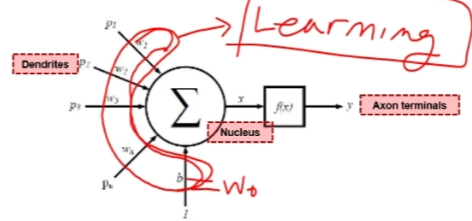
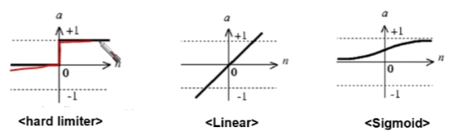
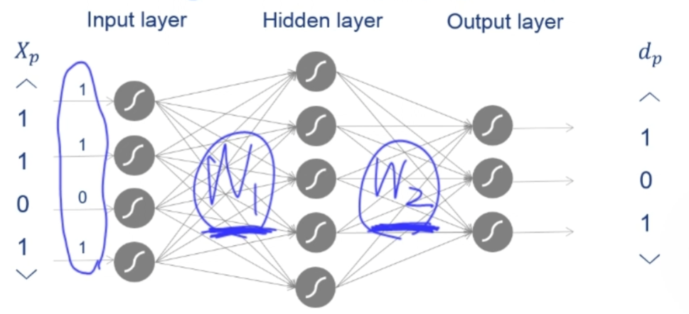
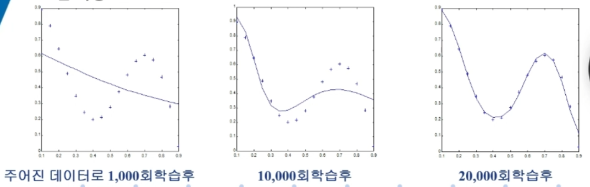

# 인공신경망(ANN) 기본 소개

## 1. 인공신경망(ANN) 소개

인공신경망(ANN)은 동물 뇌의 생물학적 신경망 구조와 기능에서 영감을 받은 컴퓨팅 모델입니다. 이 모델은 신경계의 학습 및 적응 방식을 모방하여 전통적인 상징적 AI로 해결하기 어려운 문제들을 해결하기 위해 설계되었습니다.

### 생물학적 영감

생명체는 주변 환경에 적응하고 학습합니다. 이는 주로 네트워크 형태의 "신경계(nervous system)"를 통해 이루어집니다. 이 시스템의 기본 단위는 **뉴런(neuron)** 이라는 간단한 세포입니다. 인공신경망은 뉴런의 구조를 기반으로 모델을 만들어 이러한 신경계의 기능과 행동을 재현하고자 합니다.

#### 뇌 vs. 컴퓨터

| 특징 | 뇌 | 컴퓨터 |
| :--- | :--- | :--- |
| **구성요소** | 100억 개의 뉴런, 60조 개의 시냅스 | 뉴런보다 빠름 ($10^{-9}$초 vs. $10^{-3}$초) |
| **처리 방식** | 분산 처리, 병렬 처리, 비선형 처리 | 중앙 처리, 순차 처리, 산술 연산 (선형성) |

#### 뉴런의 구조

생물학적 뉴런은 신호 전달을 담당하는 세 가지 주요 부분으로 구성됩니다:
* **수상돌기(Dendrites)**: 다른 뉴런으로부터 들어오는 "입력 신호"를 전달받습니다.
* **세포체(Soma) & 핵(Nucleus)**: 수신된 신호를 처리합니다.
* **축삭(Axon) & 축삭 말단(Axon Terminals)**: 처리된 출력 신호를 다음 뉴런으로 전파합니다.

메시지는 수상돌기에서 세포체를 거쳐 축삭을 따라 축삭 말단으로 이동합니다.

### 생물학적 모델에서 인공 모델로

인공신경망은 생물학적 뉴런의 입력(수상돌기), 처리(핵), 출력(축삭 말단) 기능을 모방한 구조를 만듭니다. ANN에서 이러한 구조를 가진 기본 단위를 **퍼셉트론(Perceptron)** 이라고 합니다.

---

## 2. 퍼셉트론

퍼셉트론은 인공신경망을 구성하는 기본 단위입니다.

### 퍼셉트론의 구조

퍼셉트론은 여러 개의 입력을 받아 처리한 후, 하나의 출력을 반환합니다. 핵심 아이디어는 입력 신호($p_i$)와 가중치($w$)의 곱을 모두 합한 값에 따라 출력 신호($y$)의 활성화 여부가 결정된다는 것입니다.

* **입력(INPUT)**: 여러 개의 입력 신호($p_i$)를 받습니다.
* **가중치($w_i$)**: 각 입력 신호는 해당하는 가중치와 곱해집니다.
* **합산($\Sigma$)**: 가중치가 적용된 모든 입력이 합산됩니다.
* **활성화 함수($f_n$)**: 합산된 값은 최종 출력을 결정하기 위해 활성화 함수를 통과합니다.

#### 활성화 함수

자주 사용되는 활성화 함수는 다음과 같습니다:
* **하드 리미터(Hard limiter)**: 입력값이 특정 임계치를 넘으면 1을, 그렇지 않으면 0 또는 -1을 출력하는 계단 함수입니다.
* **선형(Linear)**: 단순한 선형 함수입니다.
* **시그모이드(Sigmoid)**: 입력을 0과 1 사이의 값으로 매핑하는 부드러운 S자 형태의 함수입니다.

### 퍼셉트론 학습

퍼셉트론은 **지도 학습(Supervised Learning)**이라는 방법을 통해 학습합니다. 목표는 계산된 출력과 목표값 간의 차이를 최소화하는 것입니다. 이는 **위드로우-호프 규칙(Widrow-Hoff rule)** 또는 **델타 규칙(delta rule)** 을 사용하여 달성됩니다.

**Widrow-Hoff 규칙 (델타 규칙):**
계산된 출력값과 목표값 간에 차이가 있으면, 이 차이를 줄이는 방향으로 가중치($w_i$)가 변경됩니다. 차이가 없으면 가중치는 변경되지 않습니다.

학습 과정은 다음 단계를 따릅니다:
1.  **초기화**: 가중치($W_i$)와 임계치($\theta$)를 임의의 작은 값으로 초기화합니다.
2.  **입력 제시**: 새로운 입력 패턴($X_0, X_1, ...$)과 해당하는 목표 출력($d(t)$)을 제시합니다.
3.  **출력 계산**: 활성화 함수(예: 하드 리미터)를 사용하여 실제 출력값($y(t)$)을 계산합니다.
    $y(t) = f_n(\sum_{i=0}^{N-1} W_i(t)x_i(t) - \theta)$
4.  **가중치 갱신**: 목표값과 실제 출력값 간의 오차를 이용하여 가중치를 갱신합니다.
    $W_i(t+1) = W_i(t) + \alpha[d(t)-y(t)]X_i(t)$
    (여기서 $\alpha$는 학습률입니다.)

### 단층 퍼셉트론의 한계

단층 퍼셉트론은 **선형적으로 분리 가능한(linearly separable)** 문제만 해결할 수 있습니다. 그 한계를 보여주는 대표적인 예가 **XOR(배타적 논리합) 문제**입니다.

* **AND 연산 (선형 분리 가능)**: 퍼셉트론은 두 입력이 모두 1일 때만 가중치 합이 임계치를 초과하도록 하는 가중치(예: $W_0=0.3, W_1=0.4$)와 임계치(예: $\theta=0.5$)를 찾을 수 있습니다.

* **XOR 연산 (선형 분리 불가능)**: XOR 조건을 만족하는 단일 가중치($W_0, W_1$)와 임계치를 찾는 것은 불가능합니다. 조건들이 서로 모순되기 때문입니다.

이러한 비선형 문제를 해결하기 위해 여러 개의 퍼셉트론 층을 사용해야 합니다. 이것이 **역전파 신경망(Backpropagation Neural Network)** 또는 **다층 퍼셉트론(Multi-layer Perceptron, MLP)** 으로 이어집니다. 3층 퍼셉트론은 어떤 문제든 (근사적으로) 해결할 수 있음이 증명되었습니다.

---

## 3. 역전파 신경망

역전파 신경망은 입력층과 출력층 사이에 하나 이상의 **은닉층(hidden layer)** 을 가진 단방향 신경회로망입니다.

### 정의

이 구조는 단층 퍼셉트론의 선형 분리 문제(예: XOR 연산)를 해결할 수 있게 해줍니다. 일반적인 연속 함수 근사 문제 해결을 위해 널리 사용됩니다. 학습은 **오류 역전파 알고리즘(Error Backpropagation Algorithm)** 에 기반하며, 이는 일반화된 델타 규칙(generalized delta rule)이라고도 합니다.

### 학습: 오류 역전파

역전파의 핵심 개념은 **오류 함수(Error Function)** 를 최소화하는 것입니다. 이 함수는 일반적으로 원하는 목표값($d$)과 실제 출력값($\hat{y}$) 사이의 오차 제곱합으로 정의됩니다.

학습 과정은 다음과 같습니다:
1.  **순방향 전파(Forward Pass)**: 입력 패턴이 입력층에 제시되고 은닉층을 거쳐 출력층으로 전파되어 출력을 생성합니다.
2.  **오류 계산**: 신경망의 출력과 목표 출력 간의 오차를 계산합니다.
3.  **역방향 전파(Backward Pass)**: 계산된 오차는 출력층에서 발생하여 은닉층으로 역전파됩니다.
4.  **가중치 갱신**: 오차를 최소화하기 위해 연결 가중치를 조정합니다. **경사하강법(Gradient Descent Method)** 은 오차 함수에서 가장 가파른 하강 방향으로 가중치를 조정하기 위해 사용됩니다.

출력층의 오차 신호는 은닉층과 출력층 사이의 연결 가중치를 조정하는 데 사용됩니다. 그런 다음 이 오차는 입력층과 은닉층 사이의 연결 가중치를 조정하기 위해 더 뒤로 전파됩니다.

주목할 점은, 알려진 오차를 역전파하는 이 과정이 생물학적으로 타당하지 않다고 여겨진다는 것입니다. 생물학적 시스템의 하위 뉴런은 일반적으로 상위 뉴런의 목표값을 알지 못하기 때문입니다. 그럼에도 불구하고, 이는 인공신경망에서 널리 사용되는 효과적인 학습 방법입니다.

### 역전파 알고리즘 단계

시그모이드 활성화 함수를 사용할 때의 과정은 다음과 같습니다:
1.  **초기화**: 가중치(W)와 임계치($\theta$)를 임의의 값으로 초기화합니다.
2.  **데이터 제시**: 입력 벡터(X)와 목표 출력 벡터(d)를 제시합니다.
3.  **순방향 전파 (은닉층)**: 각 은닉층 뉴런으로의 입력을 계산한 후, 시그모이드 함수를 사용하여 출력을 계산합니다.
    * $Input_{pj} = \sum X_{pi}W_{ij} - \theta_j$
    * $O_{pj} = f(Input_{pj})$
4.  **순방향 전파 (출력층)**: 각 출력층 뉴런으로의 입력을 계산한 후, 시그모이드 함수를 사용하여 최종 출력을 계산합니다.
    * $Input_{pk} = \sum O_{pj}W_{jk} - \theta_k$
    * $O_{pk} = f(Input_{pk})$
5.  **출력층 오차 계산**: 각 출력 뉴런에 대한 오차항($\delta_{pk}$)을 계산합니다. 이는 목표 출력과 실제 출력의 차이에 기반합니다.
    * $\delta_{pk} = (d_{pk} - O_{pk}) * O_{pk}(1-O_{pk})$
6.  **은닉층 오차 계산**: 출력 오차를 역전파하여 각 은닉 뉴런에 대한 오차항($\delta_{pj}$)을 계산합니다.
    * $\delta_{pj} = [\sum_{k} \delta_{pk}W_{jk}] * O_{pj}(1-O_{pj})$
7.  **은닉층-출력층 가중치 갱신**: 은닉층과 출력층을 연결하는 가중치를 갱신합니다.
    * $W_{jk}(t+1) = W_{jk}(t) + \eta * \delta_{pk} * O_{pj}$
8.  **입력층-은닉층 가중치 갱신**: 입력층과 은닉층을 연결하는 가중치를 갱신합니다.
    * $W_{ij}(t+1) = W_{ij}(t) + \eta * \delta_{pj} * X_{pi}$
9.  **반복**: 모든 학습 쌍에 대해 2단계부터 8단계까지 반복합니다.
10. **중지 조건**: 전체 오차가 특정 허용값 이하로 떨어지거나 최대 반복 횟수에 도달하면 과정을 종료합니다.

### 예시: 함수 근사화

역전파 신경망은 복잡한 비선형 함수를 근사하는 데 뛰어납니다. 예를 들어, 입력 뉴런 1개, 은닉 뉴런 6개, 출력 뉴런 1개를 가진 신경망은 $y = 0.5(\cos(8x) + \sin(4x) - x + 0.8)$ 함수를 근사하도록 학습될 수 있습니다. 이 함수에서 추출된 15개의 샘플 데이터 쌍으로 학습시키면, 학습 반복 횟수가 1,000회에서 20,000회로 증가함에 따라 신경망의 출력이 함수의 곡선에 점점 더 잘 맞춰집니다.