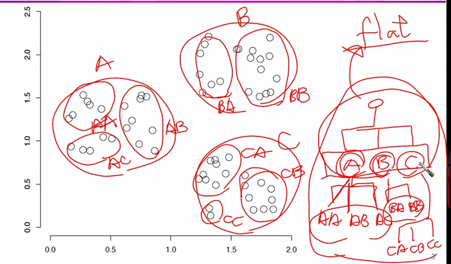
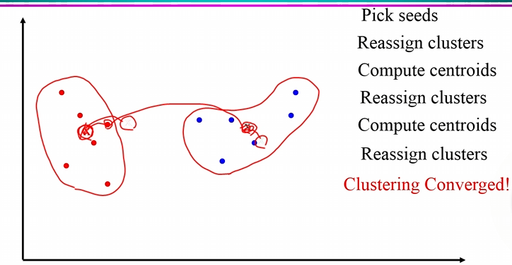
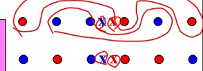

# Clustering

## 1. 클러스터링이란?

클러스터링(Clustering)은 주어진 객체 집합을 유사한 객체들로 구성된 여러 개의 클래스(또는 클러스터)로 그룹화하는 과정입니다.

-   **클러스터 내 유사성**: 같은 클러스터에 속한 문서들은 서로 유사해야 합니다.
-   **클러스터 간 비유사성**: 다른 클러스터에 속한 문서들은 서로 달라야 합니다.

클러스터링은 대표적인 **비지도 학습(Unsupervised Learning)** 방법입니다.

-   **비지도 학습**: 정답(레이블)이 없는 원시 데이터(raw data)로부터 패턴이나 구조를 학습하는 방식입니다.
-   **지도 학습 (Supervised Learning)**: 정답이 주어진 데이터를 사용하여 학습하는 방식입니다.

클러스터링은 정보 검색(IR)을 비롯한 여러 분야에서 널리 사용되는 중요한 기술입니다.

### 클러스터링의 활용 분야

클러스터링은 다양한 정보 검색(IR) 애플리케이션에서 다음과 같이 활용됩니다.

1.  **주제 계층 구조화**: 웹 페이지나 문서를 주제별로 묶어 계층적 구조로 표현합니다. (예: 과거 Yahoo!의 과학 주제 계층)
2.  **뉴스 기사 그룹화**: 관련 뉴스 기사들을 자동으로 묶어 효과적으로 보여줍니다. (예: Google 뉴스)
3.  **문서 컬렉션 시각화**: 문서 모음을 주제별로 시각화하여 표현합니다. 등고선 지도에서 각 봉우리는 하나의 클러스터를, 봉우리의 높이는 클러스터의 크기를 나타내는 방식 등으로 활용될 수 있습니다.
4.  **검색 결과 탐색 개선**: 검색 결과를 주제별로 분류하여 사용자가 더 쉽게 원하는 정보를 찾을 수 있도록 돕습니다. (예: Clusty 검색 엔진)
5.  **검색 시스템의 재현율(Recall) 향상**:
    -   **클러스터 가설**: "같은 클러스터 내의 문서들은 특정 정보 요구(질의)에 대해 유사한 연관성을 보인다."
    -   사용자의 질의에 특정 문서가 관련이 있다고 판단되면, 그 문서가 속한 클러스터의 다른 문서들도 함께 반환하여 재현율을 높일 수 있습니다.
    -   예를 들어, "car"라는 단어로 검색했을 때 "automobile"을 포함한 문서도 함께 반환될 수 있습니다. 이는 두 단어를 포함한 문서들이 유사한 단어들을 많이 포함하고 있어 벡터 공간 모델에서 높은 유사도를 가지기 때문입니다.

## 2. 문서 클러스터링의 주요 쟁점

문서 클러스터링을 수행할 때는 다음 사항들을 고려해야 합니다.

1.  **문서 표현 및 유사도 측정**:
    -   **문서 표현**: 문서를 어떻게 표현할 것인가? (예: vector space model, boolean model)
    -   **유사도/거리 척도**: 문서 간의 유사도를 어떻게 측정할 것인가? (예: 코사인 유사도, 유클리드 거리)
        -   의미적(semantic) 유사성이 이상적이지만, 실제로는 통계적(statistical) 유사성을 사용합니다.

2.  **클러스터의 개수**:
    -   클러스터 개수를 사전에 고정할 것인가?
    -   문서 컬렉션의 특징에 따라 동적으로 결정할 것인가?
    -   기본 원칙은 너무 크거나 너무 작은 "사소한(trivial)" 클러스터를 피하는 것입니다. 너무 큰 클러스터는 범위를 충분히 좁히지 못하고, 너무 작은 클러스터는 불필요한 클릭을 유발할 수 있습니다.

## 3. 클러스터링 알고리즘의 종류

클러스터링 알고리즘은 크게 두 가지로 나뉩니다.

1.  **플랫(Flat) 알고리즘**:
    -   전체 데이터를 K개의 클러스터로 나누는 방식입니다.
    -   보통 무작위 초기 분할로 시작하여 반복적으로 개선해 나갑니다.
    -   대표적인 예로 **K-평균(K-means) 클러스터링**이 있습니다.

2.  **계층적(Hierarchical) 알고리즘**:
    -   클러스터 간의 계층 구조(나무 모양)를 만듭니다.
    -   **상향식 (Bottom-up, 응집형)**: 각 문서를 하나의 클러스터로 시작하여 가장 유사한 클러스터들을 점차 합쳐 나갑니다.
    -   **하향식 (Top-down, 분할형)**: 전체 문서를 하나의 큰 클러스터로 보고, 이를 점차 작은 클러스터들로 나누어 갑니다.

## 4. K-means Clustering

K-평균은 문서를 실수 값의 용어 벡터(term vector)로 간주하고, 각 클러스터의 **중심(centroid)**을 기반으로 클러스터를 형성하는 플랫 클러스터링 알고리즘입니다.

-   **클러스터 중심(Centroid)**: 클러스터에 속한 모든 용어 벡터들의 평균 벡터입니다.
    $$\vec{\mu}(\vec{c}) = \frac{1}{|c|} \sum_{\vec{x} \in c} \vec{x}$$

### K-Means Process
1.  **초기화**: K개의 문서를 무작위로 선택하여 초기 중심(seed)으로 삼습니다.
2.  **할당 (Assignment)**: 각 문서를 유클리드 거리가 가장 가까운 중심(seed)의 클러스터에 할당합니다.
3.  **갱신 (Update)**: 각 클러스터에 속한 문서들의 평균 벡터를 계산하여 새로운 중심으로 갱신합니다.
4.  **반복**: 클러스터의 할당에 더 이상 변화가 없거나, 중심의 위치가 변하지 않는 등 특정 종료 조건을 만족할 때까지 2번과 3번 과정을 반복합니다.

### K-Means Feature
-   **종료 조건**:
    -   미리 정해둔 횟수만큼 반복
    -   클러스터 구성에 변화가 없을 때 종료
    -   클러스터 중심 위치에 변화가 없을 때 종료
    -  
-   **수렴성**: K-평균 알고리즘은 EM(Expectation-Maximization) 알고리즘의 특수한 형태로, 항상 안정된 상태로 수렴하는 것이 보장됩니다. 실제로는 수렴까지의 반복 횟수가 예상보다 크지 않은 경우가 많습니다.
-   **시간 복잡도**: $O(IKnm)$
    -   `I`: 반복 횟수
    -   `K`: 클러스터 개수
    -   `n`: 전체 문서 수
    -   `m`: 벡터 차원 (용어의 수)
    -   전체적으로 선형적인 복잡도를 가집니다.
-   **초기 중심 선택의 민감성**:
    -   초기 중심을 어떻게 선택하느냐에 따라 클러스터링 결과가 달라질 수 있습니다.
    -   잘못된 초기값은 수렴 속도를 늦추거나, 최적이 아닌 클러스터링 결과로 이어질 수 있습니다.
    -   **해결책**:
        -   휴리스틱(heuristic)을 사용하여 좋은 초기 중심을 선택합니다. (예: 이미 선택된 중심들로부터 가장 멀리 떨어진 문서를 다음 중심으로 선택)
        -   서로 다른 초기 중심으로 여러 번 알고리즘을 실행하여 가장 좋은 결과를 선택합니다.

## 5. 계층적 클러스터링 (Hierarchical Clustering)

### 1. 분할형 (Divisive) 계층적 클러스터링

-   **하향식(Top-down)** 접근법입니다.
-   전체 문서 컬렉션을 하나의 클러스터로 간주하고 시작합니다.
-   이후 K-평균과 같은 플랫 클러스터링 알고리즘을 사용하여 각 클러스터를 재귀적으로 더 작은 클러스터로 나눕니다.

### 2. 응집형 (Agglomerative) 계층적 클러스터링

-   **상향식(Bottom-up)** 접근법입니다.
-   **기본 절차**:
    1.  N개의 각 문서를 자신만을 포함하는 N개의 클러스터로 시작합니다.
    2.  모든 클러스터 쌍(pair) 간의 유사도를 계산합니다.
    3.  가장 유사한 두 클러스터를 합쳐 새로운 클러스터를 만듭니다.
    4.  클러스터의 개수가 1개가 될 때까지 2, 3번 과정을 반복합니다.

#### 클러스터 결합 방법 (유사도 측정 기준)

두 클러스터를 결합할 때, 클러스터 간의 유사도(intercluster similarity)를 계산하는 방법에 따라 세 가지로 나뉩니다.

1.  **단일 연결(Single-link) 클러스터링**:
    -   두 클러스터 간의 유사도를 **두 클러스터에 속한 모든 문서 쌍 중 가장 유사한 쌍**의 유사도로 정의합니다.
    -   느슨하게 연결된 큰 클러스터를 형성하는 경향이 있으며, "연쇄 효과(chaining effect)"가 발생할 수 있습니다.

2.  **완전 연결(Complete-link) 클러스터링**:
    -   두 클러스터 간의 유사도를 **두 클러스터에 속한 모든 문서 쌍 중 가장 덜 유사한 쌍**의 유사도로 정의합니다.
    -   작고 밀집된 클러스터를 형성하는 경향이 있습니다. 정보 검색 분야에서는 단일 연결 방식보다 더 적합할 수 있으나, 계산 비용이 더 높습니다.

3.  **그룹 평균 연결(Group average-link) 클러스터링**:
    -   두 클러스터 간의 모든 문서 쌍의 평균 유사도를 사용합니다.
    -   단일 연결과 완전 연결 방식의 절충안으로, 두 방식의 중간 정도의 클러스터 구조를 만듭니다.