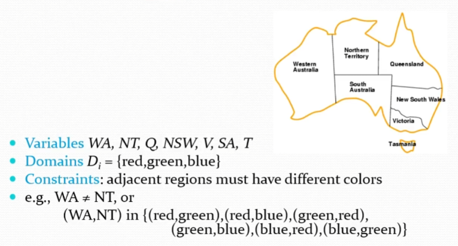
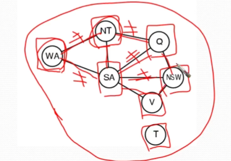
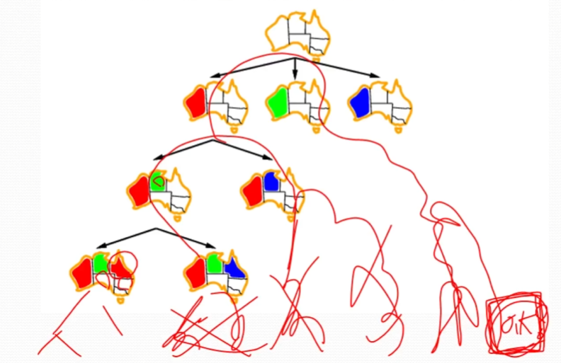
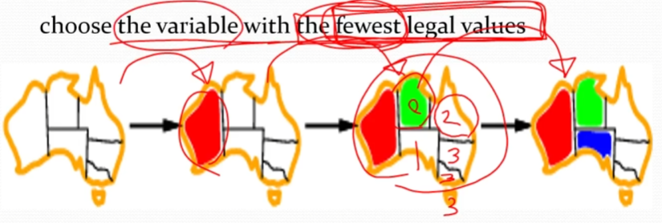
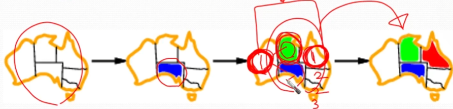
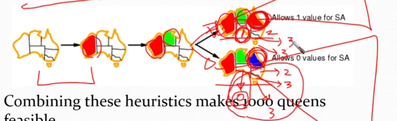
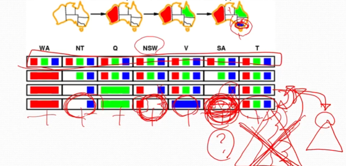
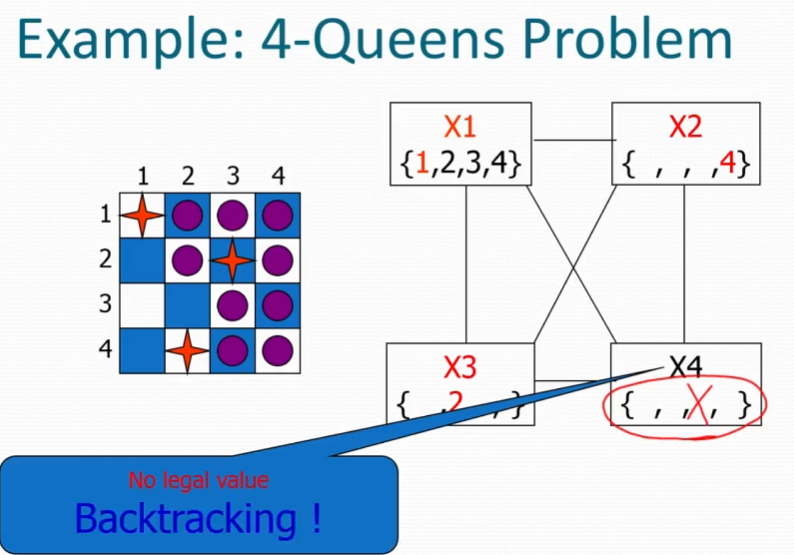
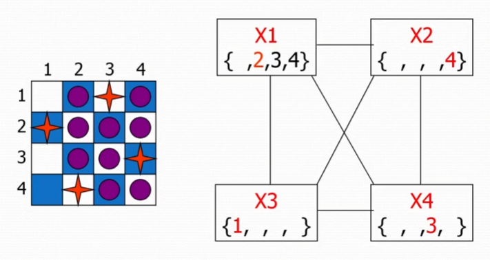
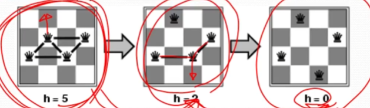

# 제약 만족 문제 (Constraint Satisfaction Problems)

## 개요

* **제약 만족 문제 (CSP)**: 변수와 제약 조건으로 정의되는 특수한 종류의 문제입니다.
* **백트래킹 탐색 (Backtracking Search)**: CSP를 해결하기 위한 기본적인 탐색 알고리즘입니다.
* **지역 탐색 (Local Search)**: CSP를 해결하는 또 다른 접근 방식입니다.

## 1. 제약 만족 문제 (CSP)란?

CSP는 표준 탐색 문제와는 다른 접근 방식을 가집니다.

* **상태(State)**: 변수 $X_i$와 각 변수에 할당될 수 있는 값의 집합인 도메인 $D_i$로 정의됩니다.
* **목표 테스트(Goal Test)**: 변수들의 값 조합이 모든 제약 조건을 만족하는지 확인하는 것입니다.

이러한 구조 덕분에 표준 검색 알고리즘보다 더 강력하고 범용적인 알고리즘을 사용할 수 있습니다.

### 예시: 지도 색칠 문제 (Map-Coloring)

호주 지도를 세 가지 색(빨강, 초록, 파랑)으로 칠하는 문제입니다.

* **변수 (Variables)**: 각 주(WA, NT, Q, NSW, V, SA, T)입니다.
* **도메인 (Domains)**: 모든 변수에 대해 `{red, green, blue}` 입니다.
* **제약 조건 (Constraints)**: 인접한 주는 서로 다른 색이어야 합니다.
    * 예: $WA \ne NT$
* **해결책 (Solutions)**: 모든 변수에 값이 할당되고 모든 제약 조건을 만족하는 상태입니다.
    * 예: WA=red, NT=green, Q=red, NSW=green, V=red, SA=blue, T=green

이러한 문제는 **제약 그래프(Constraint Graph)**로 시각화할 수 있으며, 여기서 노드는 변수를, 아크는 제약 조건을 나타냅니다.


### Kind of CSP

#### 변수의 종류
* **이산 변수 (Discrete variables)**
    * **유한 도메인**: 변수가 가질 수 있는 값의 개수가 유한합니다 (예: 지도 색칠, 불리언 CSP). $n$개의 변수와 도메인 크기 $d$가 주어지면 $O(d^n)$개의 완전한 할당이 가능합니다.
    * **무한 도메인**: 정수나 문자열과 같이 도메인이 무한합니다 (예: 작업 스케줄링).
* **연속 변수 (Continuous variables)**
    * 변수가 연속적인 값을 가집니다 (예: 허블 우주 망원경 관측 시간).

#### 제약 조건의 종류
* **단항 제약 조건 (Unary constraints)**: 단일 변수에 대한 제약입니다 (예: $SA \ne green$).
* **이항 제약 조건 (Binary constraints)**: 두 변수 간의 관계에 대한 제약입니다 (예: $SA \ne WA$).
* **고차 제약 조건 (Higher-order constraints)**: 세 개 이상의 변수를 포함하는 제약입니다 (예: 암호 산술).

#### 계산 복잡도
- d: 각 변수가 가질 수 있는 값의 개수(도메인 크기)
- l: 탐색 트리의 깊이
- n: 변수의 종류
- 탐색 트리의 깊이 l에서 branching factor **b는 $(n-l)d$** 이다.
- 트리의 총 leaf 노드의 수는 $n! * d^n$

### 실제 세계의 CSP 응용 분야
다양한 실제 문제들이 CSP로 모델링될 수 있습니다:
* 과제 문제 (Assignment problems)
* 시간표 문제 (Timetabling problems)
* 운송 스케줄링 (Transportation scheduling)
* 공장 스케줄링 (Factory scheduling)


## 2. 백트래킹 탐색 (Backtracking Search)
백트래킹 탐색은 제약 만족 문제(CSP)를 해결하기 위한 기본적인 비정보 탐색 알고리즘입니다. 
본질적으로 이는 깊이 우선 탐색(DFS)을 CSP에 맞게 변형한 것입니다.
만약 어떤 변수에 값을 할당했을 때 제약 조건에 위배되어 더 이상 해를 찾을 수 없는 막다른 길에 도달하면, 마지막으로 값을 할당했던 변수의 상태로 되돌아가(backtrack) 다른 값을 시도


### 표준 탐색 공식
* **초기 상태**: 빈 할당 `{}`.
* **후임자 함수**: 현재 할당과 충돌하지 않는 값을 아직 할당되지 않은 변수에 할당합니다.
* **목표 테스트**: 현재 할당이 완전하고 일관성이 있는지 확인합니다.

### 시간복잡도
백트래킹은 변수 할당 순서를 고정하거나 특정 규칙으로 정하므로, 각 노드에서는 단일 변수에 대한 값만 고려하면 됩니다. 
따라서 분기 계수(b)는 단순히 도메인 크기인 d가 되며, 탐색 트리의 잎 노드 수는 $d^n$이 됩니다. 
이는 일반적인 CSP 탐색에 비해 훨씬 개선된 것

### 백트래킹 알고리즘

```javascript
function BACKTRACKING_SEARCH(csp) { // returns a solution, or failure
    return RECURSIVE_BACKTRACKING({}, csp)
}
function RECURSIVE_BACKTRACKING(assignment, csp) { // returns a solution, or failure
    if (assignment == complete) return assignment
    // 아직 값이 할당되지 않은 변수 하나를 선택
    var unassigedVariable = SELECT_UNASSIGNED_VARIABLE(csp)
    // 선택된 변수의 도메인에 있는 각 값에 대해 다음을 반복
    for (value in ORDER_DOMAIN_VALUES(unassigedVariable, assignment, csp))
        // 해당 값을 변수에 할당했을 때 기존의 할당과 충돌(제약 조건 위반)이 없는지 확인
        if (value == consistent) { // consistent with assignment
            // 충돌이 없다면, 변수와 값을 현재 할당에 추가하고 재귀적으로 다음 변수를 탐색
            add {unassigedVariable = value} to assignment
            result = RECURSIVE_BACKTRACKING(assignment, csp)
            // 만약 재귀 호출이 성공적인 해를 반환하면, 그 해를 그대로 위로 전달
            if (result != failure) return result
            // 해를 찾지 못했다면, 해당 변수에 대한 할당을 제거하고 실패를 반환
            remove {unassigedVariable = value} from assignment
        }
    return failure
}
```


### 백트래킹 효율성 향상 기법

알고리즘의 속도를 크게 향상시킬 수 있는 몇 가지 일반적인 방법이 있습니다.

1.  **어떤 변수를 다음에 할당할 것인가? (Variable Ordering)**
    * **최소 잔여 값 (Minimum Remaining Values, MRV) 휴리스틱**: 선택할 수 있는 legal 값이 가장 적은 변수를 먼저 선택합니다. "가장 제약이 많은 변수"라고도 합니다.
    * 
    * **최다 제약 변수 (Most Constraining Variable) 휴리스틱**:
      * 다른 미할당 변수에 가장 많은 제약 조건을 가하는 변수를 선택합니다.
      * 주로 **Minimum Remaining Values (MRV) 휴리스틱의 동점 해결사(Tie-breaker)**로 사용
    * 

2.  **어떤 순서로 값을 시도할 것인가? (Value Ordering)**
    * **최소 제약 값 (Least Constraining Value) 휴리스틱**: 다른 변수들이 선택할 수 있는 값의 수를 가장 적게 배제하는 값을 먼저 시도합니다.
    * 
    * n-Queens를 25개에서 1000개까지도 작업가능하다.

3.  **불가피한 실패를 조기에 감지할 수 있는가?**
    * **전방 탐색 (Forward Checking)**: 변수에 값을 할당할 때, 이 할당으로 인해 제약 조건에 연결된 다른 미할당 변수들의 도메인에서 유효하지 않은 값들을 제거합니다. 만약 어떤 변수의 도메인이 비게 되면, 탐색은 즉시 해당 경로를 포기하고 백트래킹합니다.
    * 

4.  **문제의 구조를 활용할 수 있는가?**

이러한 휴리스틱의 조합은 1000-퀸 문제와 같은 복잡한 문제도 해결 가능하게 만듭니다.

### 예시: 4-퀸 문제 (4-Queens Problem)
4x4 체스판에 4개의 퀸을 서로 공격할 수 없도록 배치하는 문제입니다. 전방 탐색과 백트래킹을 통해 한 단계씩 해결 과정을 시각적으로 보여줍니다.
초기 상태에서 퀸을 하나씩 배치하면서, 전방 탐색으로 인해 다른 퀸을 놓을 수 있는 위치가 줄어드는 것을 확인할 수 있습니다.
만약 더 이상 퀸을 놓을 수 없는 상태가 되면(즉, 변수의 도메인이 비게 되면), 알고리즘은 백트래킹하여 이전 상태로 돌아가 다른 선택을 합니다.
이 과정을 반복하여 최종 해결책을 찾습니다.
- 
- 


## 3. 지역 탐색 (Local Search)

지역 탐색은 모든 변수에 값이 할당된 '완전한' 상태에서 시작하여 해를 찾아가는 방법입니다.

* 제약 조건이 만족되지 않은 상태를 허용합니다.
* 연산자는 변수의 값을 재할당하는 방식으로 작동합니다.
* **최소-충돌 (Min-Conflicts) 휴리스틱**: 충돌하는 제약 조건의 수를 최소화하는 값을 선택합니다. 이는 평가 함수 $h(n)$이 위반된 제약 조건의 총 수인 언덕 오르기(hill-climbing) 방식입니다.

### 예시: 4-퀸 문제
* **상태**: 4개의 열에 각각 퀸이 하나씩 배치된 상태 ($4^4 = 256$개의 상태).
* **행동**: 한 열의 퀸을 다른 행으로 이동.
* **목표 테스트**: 공격받는 퀸이 없는 상태.
* **평가 함수 $h(n)$**: 현재 공격받고 있는 퀸 쌍의 수.

지역 탐색은 임의의 초기 상태에서 시작하여 매우 큰 n 값에 대해서도 (예: n=10,000,000) 거의 상수 시간에 n-퀸 문제를 해결할 수 있습니다.


## 요약

* CSP는 고정된 변수 집합의 값으로 상태가 정의되고, 변수 값에 대한 제약 조건으로 목표가 정의되는 특별한 문제입니다.
* 백트래킹은 노드당 하나의 변수가 할당되는 깊이 우선 탐색입니다.
* 변수 및 값 선택 휴리스틱은 알고리즘의 효율성을 크게 향상시킵니다.
* 전방 탐색은 나중의 실패를 보장하는 할당을 방지합니다.
* 제약 전파(Constraint propagation)는 값에 제약을 가하고 불일치를 감지하는 추가 작업을 수행합니다.
* 언덕 오르기 탐색을 위한 반복적인 최소-충돌 휴리스틱은 실제 문제에서 효과적입니다.