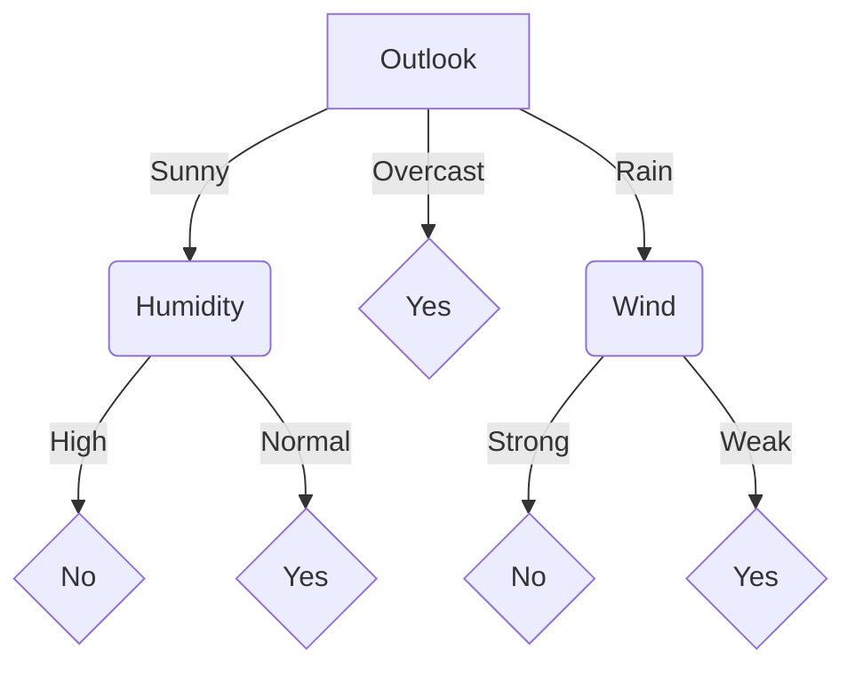
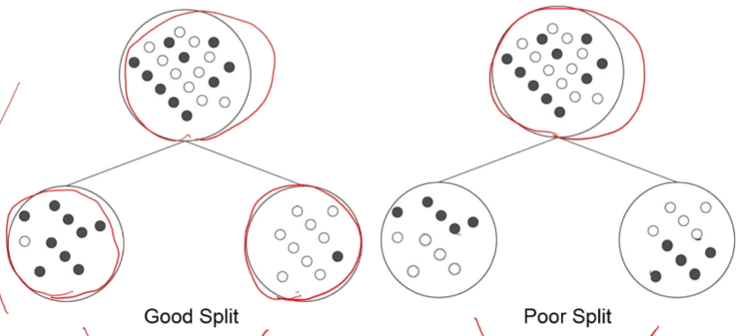
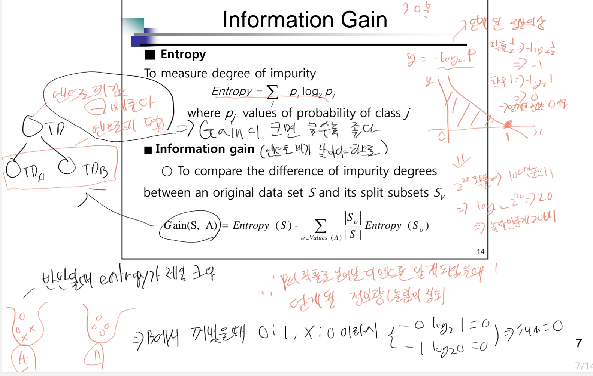
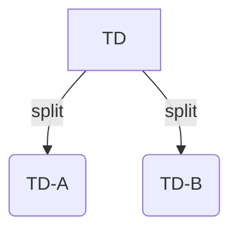
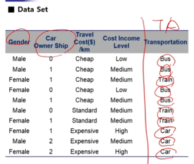
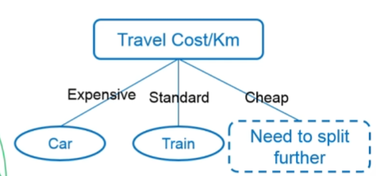
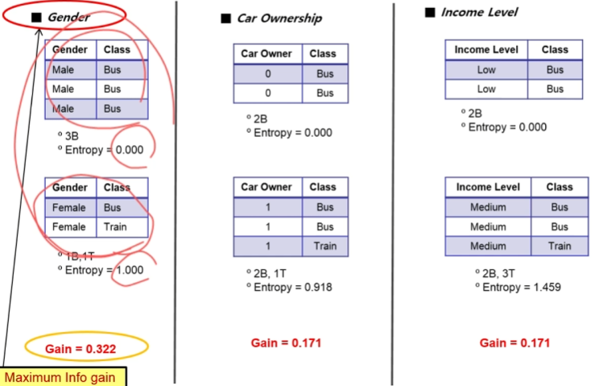
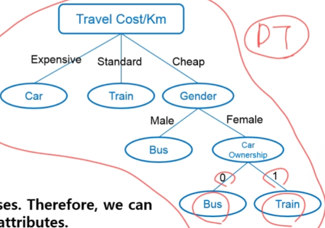

# Decision Tree

## 1. Decision Tree

의사결정 트리는 의사결정 규칙을 나무 구조로 나타내어 전체 데이터를 특정 기준에 따라 작은 그룹으로 나누는 과정을 시각화한 분석 도구입니다. 분류(Classification)와 예측(Prediction) 문제에 널리 사용되는 강력한 기법입니다.

### 의사결정 트리의 구성 요소

- **내부 노드 (Internal Node)**: 속성(Attribute)에 대한 테스트를 나타냅니다. 데이터를 나눌 기준이 되는 변수입니다.
- **가지 (Branch)**: 내부 노드의 테스트 결과(속성 값)를 나타냅니다.
- **잎 노드 (Leaf Node)**: 최종적인 분류 결과(Classification) 또는 예측 값을 나타냅니다.

### 예시: 테니스 경기 여부 결정

아래는 날씨 상태에 따라 테니스를 칠지 말지를 결정하는 의사결정 트리의 예시입니다.

```
if (전망 = 맑음 AND 습도 = 보통)
  OR (전망 = 흐림)
  OR (전망 = 비 AND 바람 = 약함)
then Yes (경기를 한다)
else No (경기를 안 한다)
```

이 규칙은 다음과 같은 트리 구조로 표현될 수 있습니다.



## 2. 의사결정 트리의 작동 원리: 분할 (Splitting)

의사결정 트리의 핵심은 **분할**입니다. 분할은 하나의 큰 데이터 집합(heterogeneous, 이질적인)을 특정 규칙에 따라 더 작은 부분집합(Subset)으로 나누는 과정입니다.
이 과정의 목표는 각 부분집합이 가능한 한 **동질적인(Homogeneous)** 상태가 되도록 만드는 것입니다.

- **동질성 (Homogeneity)**: 특정 그룹 내의 데이터들이 모두 동일한 목표 값(클래스)을 갖는 상태를 의미합니다.
- **불순도 (Impurity)**: 그룹 내에 여러 클래스의 데이터가 섞여 있는 정도를 나타냅니다.

**좋은 분할(Good Split)** 은 분할 후 생성된 자식 노드들의 불순도가 부모 노드보다 현저히 낮아지는, 즉 순도(Purity)가 크게 증가하는 분할을 의미합니다.


## 3. 분할 기준: 불순도 측정(Impurity Measures)

최적의 분할 기준을 찾기 위해 데이터 집합의 불순도를 수치적으로 측정하는 지표가 사용됩니다.

### 1) 엔트로피 (Entropy)와 정보 획득 (Information Gain)

#### 엔트로피 (Entropy)

엔트로피는 데이터 집합의 불순도를 측정하는 지표입니다. 엔트로피가 높을수록 여러 클래스가 섞여 있다는 의미이며, 0이면 모든 데이터가 단일 클래스로 구성된 순수(Pure) 상태임을 의미합니다.

$$Entropy = \sum_{j} -p_{j} \log_{2} p_{j}$$

- $p\_j$ : 클래스 j에 속하는 데이터의 비율

#### 정보 획득 (Information Gain)

정보 획득은 특정 속성을 사용하여 데이터를 분할했을 때 엔트로피가 얼마나 감소했는지를 나타내는 지표입니다. 정보 획득이 클수록 해당 속성이 데이터를 더 잘 분류한다는 의미이며, 의사결정 트리는 **정보 획득이 최대가 되는 속성**을 분할 기준으로 선택합니다.

* TD의 Entropy와 TD-A, TD-B의 엔트로피들의 합을 뺀게 Gain 값
* Entropy는 작을 수록 좋으니 Gain은 클수록 좋다.

$$Gain(S, A) = Entropy(S) - \sum_{v \in Values(A)} \frac{|S_{v}|}{|S|} Entropy(S_{v})$$

- $S$: 현재 데이터 집합
- $A$: 분할 기준으로 사용할 속성
- $Values(A)$: 속성 A가 가질 수 있는 값들의 집합
- $S\_v$: 속성 A의 값이 v인 데이터의 부분집합

### 2) 지니 지수 (Gini Purity)

지니 지수는 엔트로피와 유사하게 데이터 집합의 불순도를 측정하는 지표입니다. 값이 작을수록 순도가 높습니다.

$$Gini = \sum_{j} p_{j}^{2}$$

지니 지수를 이용한 정보 획득 계산도 엔트로피와 유사하며, 기존 엔트로피 계산을 지니 지수 계산으로 대체하여 사용합니다.

## 4. 의사결정 트리 구축 과정 예시
교통수단(Transportation)을 예측하는 의사결정 트리를 구축하는 과정은 다음과 같습니다.


**데이터 속성**: `성별`, `차량 소유 여부`, `이동 비용`, `소득 수준`
**목표 변수**: `교통수단 (버스, 기차, 자가용)`
### Entropy Measure
1. Original Dataset Entropy : $-0.4log(0.4) - 0.3log(0.3) - 0.3log(0.3) = 1.571$
2. SubGroup-Male : $-\frac{3}{5}log(\frac{3}{5}) - \frac{1}{5}log(\frac{1}{5}) - \frac{1}{5}log(\frac{1}{5}) = 1.371$
3. SubGroup-Female : $-\frac{1}{5}log(\frac{1}{5}) - \frac{2}{5}log(\frac{2}{5}) - \frac{2}{5}log(\frac{2}{5}) = 1.522$
4. Gain Measure
   - Gain of attribute Gender : $1.574 - (\frac{5}{10} * 1.371 + \frac{5}{10} * 1.522) = 0.125$
   - Gain of attribute Car Ownership : $0.534$
   - Gain of attribute Travel Cost : $1.210$
   - Gain of attribute Income Level : $0.695$
5. Travel Cost로 분할

### 1단계: 첫 번째 분할 (루트 노드 결정)

1.  전체 데이터 집합의 엔트로피를 계산합니다.
2.  각 속성(`성별`, `차량 소유 여부` 등)을 기준으로 데이터를 분할했을 때의 정보 획득(Information Gain)을 각각 계산합니다.
3.  계산 결과, **'이동 비용(Travel Cost)'** 속성의 정보 획득이 가장 높게 나타났습니다. 따라서 '이동 비용'이 트리의 **루트 노드**가 됩니다.
4.  '이동 비용'의 값('Expensive', 'Standard', 'Cheap')에 따라 데이터를 분할합니다.
    - `Expensive` → `Car` (순수)
    - `Standard` → `Train` (순수)
    - `Cheap` → 여러 교통수단이 섞여 있어 **추가 분할 필요**

### 2단계: 두 번째 분할

1.  '이동 비용'이 'Cheap'인 데이터 부분집합에 대해 과정을 반복합니다.
2.  남은 속성(`성별`, `차량 소유 여부`, `소득 수준`)에 대한 정보 획득을 계산합니다.
3.  계산 결과, **'성별(Gender)'**의 정보 획득이 가장 높게 나타나 다음 분할 기준으로 선택됩니다.
4.  '성별'의 값('Male', 'Female')에 따라 데이터를 분할합니다.
    - `Male` → `Bus` (순수)
    - `Female` → 여전히 섞여 있어 **추가 분할 필요**

### 3단계: 최종 분할 및 트리 완성

1.  '성별'이 'Female'인 데이터 부분집합에 대해 과정을 반복합니다.
2.  남은 속성(`차량 소유 여부`, `소득 수준`)으로 분할하면 각각 순수한 노드가 생성됩니다. 여기서는 **'차량 소유 여부(Car Ownership)'** 를 기준으로 분할합니다.
    - `0` (소유 안 함) → `Bus` (순수)
    - `1` (소유 함) → `Train` (순수)

모든 잎 노드가 순수 상태가 되면 트리 구축이 완료됩니다.


## 5. 의사결정 트리의 종류
- **이진 트리 (Binary Tree)**: 각 분기점에서 두 개의 가지로만 나뉘는 트리 (예: `점수 >= 90%?` -\> Yes/No).
- **다항 트리 (N-way Tree)**: 각 분기점에서 세 개 이상의 가지로 나뉠 수 있는 트리 (예: `날씨` -\> 맑음/흐림/비).

## 6. 장점 및 단점
### 장점
1.  **이해하기 쉬움**: 트리 구조가 시각적이고 직관적이어서 비전문가도 쉽게 이해할 수 있습니다.
2.  **규칙 생성**: 비즈니스 규칙(Business Rule)으로 쉽게 변환할 수 있습니다.
3.  **데이터 전처리 용이**: 데이터의 특정 분포에 대한 가정이 필요 없으며, 숫자형과 범주형 변수를 모두 처리할 수 있습니다.

### 단점
1.  **불안정성**: 훈련 데이터의 작은 변화에도 트리의 구조가 크게 바뀔 수 있어 불안정합니다.
2.  **복잡성**: 연속적인 숫자형 속성이 많은 경우 트리가 매우 복잡하고 깊어질 수 있습니다.
3.  **제한된 목표 변수**: 목표(Target) 변수는 범주형이어야 하며, 하나의 목표 변수만 처리할 수 있습니다.
