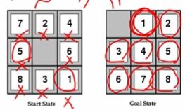
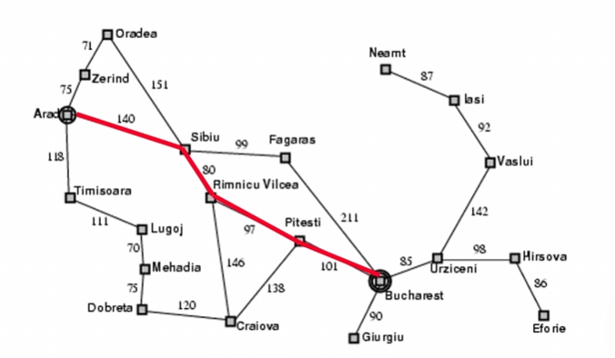
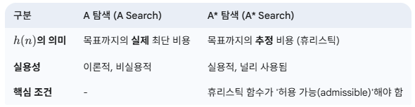

# Informed Search

## 개요: 비정보 탐색의 한계와 정보 탐색의 필요성
비정보 탐색(Uninformed Search) 방법의 한계를 지적하며 정보 탐색(Informed Search) 또는 휴리스틱 탐색(Heuristic Search)의 필요성을 강조합니다.
비정보 탐색은 8-퍼즐과 같은 문제에서 엄청난 수의 상태 공간을 탐색해야 하므로 비효율적입니다. 
이는 실제 문제 해결에 있어 엄청난 시간 복잡도를 야기합니다.

정보 탐색은 "문제별 휴리스틱을 사용하여 효율성을 향상"시키며, 이를 통해 "실제로 상당한 속도 향상을 제공"할 수 있습니다.
하지만 최악의 경우 여전히 지수적 시간 복잡도를 가질 수 있습니다.

## 정보 탐색 (Informed/Heuristic Search)
정보 탐색은 문제별 지식을 활용하여 탐색 공간을 효율적으로 탐색하는 방법입니다.

### 최적 우선 탐색 (Best-First Search)
최적 우선 탐색은 "각 노드에 대한 평가 함수 f(n)을 사용하여 가장 바람직한 확장되지 않은 노드를 확장" 하는 아이디어를 기반으로 합니다.
이 방법은 fringe(탐색할 노드들의 집합)에 있는 노드들을 f(n) 값에 따라 정렬하여 가장 낮은 f(n) 값을 가진 노드부터 확장합니다.

* 특별한 경우
  * 균일 비용 탐색 (Uniform Cost Search): f(n) = g(n) (n까지의 경로 비용)
  * 탐욕적 최적 우선 탐색 (Greedy Best-First Search): f(n) = h(n) (목표까지의 추정 비용, 휴리스틱 함수)
  * A 탐색 (A Search):** f(n) = g(n) + h(n) (n까지의 실제 비용 + 목표까지의 추정 비용)

### 휴리스틱 함수 (Heuristic Function)
"휴리스틱"은 "답을 찾기 위한 경험적 규칙을 사용하는 것"으로 정의됩니다.
휴리스틱 함수 h(n)은 "n에서 목표까지의 (최적) 비용 추정치"를 제공하며, 목표 노드일 경우 h(n) = 0입니다.
이 함수는 실제 상태 공간 거리가 아닌 추정치이며, "탐색 알고리즘에 문제별 지식을 제공"합니다.

* h1과 h2의 차이 : 성능을 비교하기 위한 명칭이고 목표까지의 남은 거리를 얼마나 더 정교하게 추정하는가?에 있다. 결론적으로 h2가 h1보다 더 많은 정보를 사용해 정확하므로 일반적으로 더 우수하다.

* 8-퍼즐의 휴리스틱 예시:
  * 
  * h1 = 잘못 배치된 타일의 개수 (number of misplaced tiles): 예를 들어, h1(s) = 8
  * h2 = 타일들이 목표 위치로부터 떨어진 거리의 합 (맨해튼 거리 - Manhattan distance): 예를 들어, h2(s) = 18
  * 이러한 휴리스틱 함수는 "탐색 과정을 줄일 수 있습니다."

### 탐욕적 최적 우선 탐색 (Greedy Best-First Search)
이 탐색은 h(n)을 평가 함수로 사용하여 "목표에 가장 가깝다고 보이는 노드를 확장"합니다.

* 탐욕적 최적 우선 탐색의 속성:
  * 완전성 (Complete)? 아니오. "모든 방문한 상태를 추적하지 않으면" DFS처럼 루프에 빠질 수 있습니다.
  * 최적성 (Optimal)? 아니오. 예시에서 비최적 해를 찾는 경우가 있었습니다.
  * 시간 (Time)? O(bm) (최악의 경우, 솔루션을 찾기 전에 깊이 m의 모든 노드를 생성할 수 있습니다.)
  * 공간 (Space)? O(bm) (최악의 경우, 솔루션을 찾기 전에 깊이 m의 모든 노드를 생성할 수 있습니다.)

### A* 탐색 (A* Search)
A* 탐색은 "노드를 통해 목표까지의 총 경로 비용 추정치를 기반으로 노드를 확장"합니다.
평가 함수는 "f(n) = g(n) + h(n)"으로 정의됩니다.
여기서 **g(n)은 n까지 도달하는 데 소요된 비용**이고, **h(n)은 n에서 목표까지의 추정 비용**입니다.
"탐색의 효율성은 휴리스틱 h(n)의 품질에 따라 달라집니다."

* *라는 기호는 optimal을 내재한 표현으로 많이씀
* 허용 가능한 휴리스틱 (Admissible heuristics): A Search가 아닌 A* Search가 되기 위해
  * "휴리스틱 h(n)은 모든 노드 n에 대해 h(n) ≤ h*(n)일 때 허용 가능하며, 여기서 h*(n)은 n에서 목표 상태까지 도달하는 실제 비용입니다."
  * 

* A* 탐색의 속성:
  * 완전성 (Complete)? "예" (f ≤ f(G)인 노드가 무한히 많지 않는 한)
  * 최적성 (Optimal)? "예"
  * 최적으로 효율적: "주어진 휴리스틱에 대해 다른 최적 알고리즘보다 적은 노드를 확장합니다."
  * 시간 (Time)? "최악의 경우 지수적"
  * 공간 (Space)? "최악의 경우 지수적"

### 휴리스틱 함수의 지배 (Dominance) 및 효과
인공지능 탐색에서 휴리스틱 함수의 성능을 평가할 때 지배(Dominance)라는 개념을 사용함
* "모든 n에 대해 h2(n) ≥ h1(n)이고 (둘 다 허용 가능)이면 h2는 h1을 지배합니다."
* h2가 탐색에 더 좋습니다.(h1 <= h2 <= h*)
* 8-퍼즐 문제에 대한 평균 탐색 비용 비교:
  * d=12: IDS = 3,644,035 노드, A*(h1) = 227 노드, A*(h2) = 73 노드
  * d=24: IDS = 너무 많은 노드, A*(h1) = 39,135 노드, A*(h2) = 1,641 노드 이 결과는 A*와 더 강력한 휴리스틱이 탐색 노드 수를 현저히 줄임을 보여줍니다.

### "완화된 문제"를 통한 휴리스틱 발명
좋은 휴리스틱 함수를 단순히 직감으로 만드는 것이 아니라, 기존의 문제를 더 단순하게 변형하는 '완화'라는 기법을 통해 논리적으로 설계할 수 있다
* 예시: "벽을 통과할 수 없다"는 규칙이 있는 미로 찾기 문제에서, "벽을 마음대로 통과할 수 있다"고 규칙을 바꾸면 이것이 바로 완화 문제가 됩니다.
* **허용 가능한 휴리스틱(Admissible Heuristic)** 이란, 실제 목표 지점까지의 비용을 절대 과대평가하지 않는(즉, 항상 실제 비용보다 작거나 같은) 추정치를 말합니다. A 알고리즘이 최적의 해를 찾기 위한 필수 조건

## 지역 탐색 (Local Search)
경로 자체가 중요하지 않은 문제에 대한 지역 탐색 방법을 소개합니다.

### 지역 탐색 및 최적화의 특징
* 이전 접근 방식: 목표까지의 경로가 문제의 해였습니다.
* 지역 탐색: "단일 현재 상태를 추적"하고 "인접 상태로만 이동"하며 "경로를 무시"합니다.
  * 장점:"메모리를 거의 사용하지 않습니다."
  * "크거나 무한한 (연속적인) 상태 공간에서 합리적인 솔루션을 찾을 수 있습니다."

* "순수 최적화" 문제의 특징:
  * 모든 상태에는 목적 함수 또는 휴리스틱 함수가 있습니다.
  * 목표는 목적 함수 값이 최대(또는 최소)인 상태를 찾는 것입니다.
  * 경로 비용/목표 상태 공식에 잘 맞지 않습니다.
  * 지역 탐색은 이러한 문제에서 매우 효과적일 수 있습니다.

### 언덕 오르기 탐색 (Hill-climbing Search)
언덕 오르기 탐색은 "값이 증가하는 방향으로 계속 이동"하며 "정점에 도달하면 종료"되는 매우 간단한 알고리즘입니다.
* 이는 "탐욕적 지역 최적 탐색"의 일종입니다.
  * "언덕 오르기는 현재 상태의 바로 인접한 이웃들만을 내다봅니다."
  * "두꺼운 안개 속에서 에베레스트 산 정상에 오르려는 시도"로 비유됩니다.
* 문제점: 지역 최댓값 (Local Maxima)
  * 지역 최댓값이 존재할 때 언덕 오르기는 비최적적입니다.
  * 간단하고 효과적인 해결책: "다중 무작위 재시작 (Multiple random restarts)"

### 8-퀸 문제 예시
8-퀸 문제는 지역 탐색의 좋은 예시입니다. 모든 8개의 퀸이 보드에 배치된 상태에서 목표는 서로 공격하지 않도록 하는 것입니다.

* 후속 함수 (Successor function): 한 열에서 단일 퀸을 다른 칸으로 이동합니다.
* 휴리스틱 함수 h(n): "서로 공격하는 퀸 쌍의 수" (이 값을 최소화하고자 합니다.)
* 8-퀸 문제에서의 언덕 오르기 성능:
  * 무작위로 생성된 8-퀸 시작 상태에서:
    * "14%의 확률로 문제를 해결"합니다.
    * "86%의 확률로 지역 최솟값에 갇힙니다."
    * 하지만 성공할 때 평균 4단계, 갇힐 때 평균 3단계만 소요됩니다 (약 1700만 상태 공간에서).

### 무작위 재시작을 포함한 언덕 오르기 (Hill-climbing with random restarts)
* 변형: 고정된 수 N의 재시작을 실행하고, 각 재시작마다 종료될 때까지 실행합니다.
* 분석: 각 탐색의 성공 확률이 p라고 가정합니다 (8-퀸의 경우 p = 0.14).
  * 99% 이상의 성공을 위한 예상 재시작 횟수 n: (0.86)^n < 0.01 ⇒ n > log0.86(0.01) ≈ 30.53 (따라서 약 31번 재시작).
  * 예상 최대 단계 수: 4단계 * 31 = 124단계 (약 1700만 상태 공간에서). 이 결과는 무작위 재시작이 비록 개별 시도가 실패할 수 있더라도, 전체적으로 매우 큰 상태 공간에서 효율적으로 해결책을 찾을 수 있음을 시사합니다.