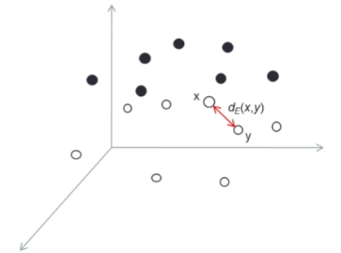
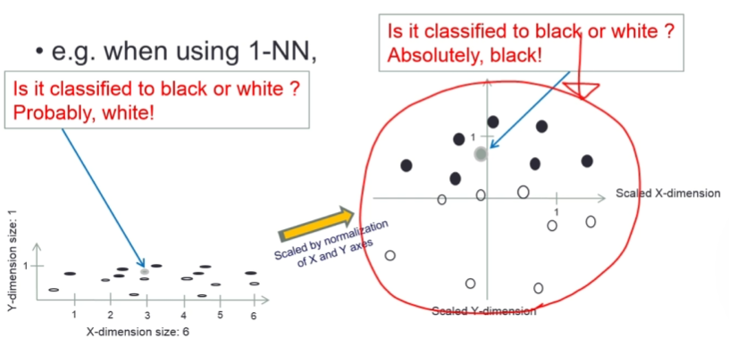
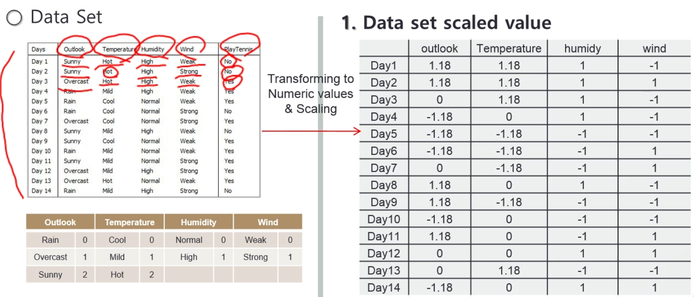
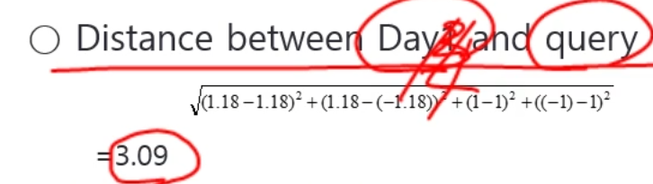

# KNN(k Nearest Neighbor) Classifier
## KNN Classfier?

k-최근접 이웃(kNN) 분류기는 객체를 분류하는 방법 중 하나로, 속성 벡터 공간에서 가장 가까운 학습 데이터(인스턴스)를 기반으로 분류를 수행합니다. 이는 인스턴스 기반 학습 또는 지연 학습(lazy learning)의 한 유형에 속합니다. 지연 학습이란 분류 함수가 지역적으로만 근사화되고 모든 계산이 실제 분류 과정이 수행될 때까지 지연되는 특징을 가집니다.

객체는 k개의 가장 가까운 이웃의 다수결 투표를 통해 분류됩니다. 예를 들어, k가 1이라면, 해당 객체는 가장 가까운 이웃의 클래스로 단순히 할당됩니다.

* **1-최근접 이웃(1-Nearest Neighbor)**: 새로운 데이터가 주어졌을 때, 가장 가까운 단 하나의 이웃을 찾아 그 이웃의 클래스로 분류합니다.
* **3-최근접 이웃(3-Nearest Neighbor)**: 새로운 데이터 주변의 가장 가까운 3개의 이웃을 확인하고, 다수결 원칙에 따라 클래스를 결정합니다.

## KNN의 주요 특징

* **인스턴스 표현**: 모든 인스턴스는 n차원의 유클리드 공간에 있는 점으로 표현됩니다.
* **지연된 분류**: 새로운 인스턴스가 들어올 때까지 분류가 지연됩니다.
* **비교 기반 분류**: 서로 다른 점들의 벡터를 비교하여 분류를 수행합니다.
* **유연한 목표 함수**: 목표 함수(분류 함수)는 이산적이거나 실수 값을 가질 수 있으며, 이는 공간상에서 인스턴스가 어떻게 표현되는지에 따라 달라집니다.

## 거리 측정 방법

kNN에서 이웃을 찾기 위해 거리를 측정해야 합니다. 임의의 인스턴스는 $<a_{1},a_{2},...,a_{n}>$ 형태의 벡터로 표현되며, 여기서 $a_i$는 i번째 속성을 나타냅니다. 일반적으로 유클리드 거리나 절대 거리가 사용됩니다.

* **유클리드 거리**:
  $d_{E}(x,y)=\sqrt{\sum_{i=1}^{N}(x_{i}-y_{i})^{2}}$
* **절대 거리(맨해튼 거리)**:
  $d_{A}(x,y)=\sum_{i=1}^{N}|x_{i}-y_{i}|$

## 데이터 처리

### 범주형 속성 처리

kNN 분류를 위해 인스턴스의 범주형(Categorical, 비수치적) 속성은 상응하는 수치 값으로 변환될 수 있습니다.
이를 통해 모든 인스턴스를 유클리드 공간의 수치 벡터로 표현할 수 있습니다.

**예시**:
* Outlook = { Rain = 0, Overcast = 1, Sunny = 2 }
* Temperature= { Cool = 0, Mild = 1, Hot = 2 }
* Humidity = { Normal = 0, High = 1 }
* Wind = { Weak = 0, Strong = 1 }

위의 규칙에 따라 <Sunny, Hot, High, Weak>라는 인스턴스는 <2, 2, 1, 0>으로 변환됩니다.

### 속성 값 스케일링 (정규화)

각 속성의 차원 크기 차이가 결과에 미치는 영향을 완화하기 위해 속성 값을 정규화(scaling)하기도 합니다.
속성 스케일링은 종종 kNN 분류의 정확도를 향상시킵니다. 
스케일링을 하지 않으면 특정 축의 큰 값 때문에 거리 계산이 왜곡될 수 있지만, 정규화를 통해 각 속성이 균등하게 영향을 미치도록 조정할 수 있습니다.

* **정규화 공식**:
  $x^{\prime}=\frac{x-\overline{x}}{\sigma(x)}$
    * $\overline{x}$: 속성 값의 평균
    * $\sigma(x)$: 속성 값의 표준편차

## kNN 분류 예제 (k=3)

다음은 날씨 데이터셋을 기반으로 테니스를 칠 수 있는지 예측하는 예제입니다.

**질문**: 날씨가 "sunny", 기온이 "cool", 습도가 "high", 바람이 "strong"일 때 테니스를 치기 좋은 날인가?

1.  **데이터 변환 및 스케일링**:
    * 기존 데이터셋의 범주형 값을 수치로 변환하고 정규화합니다.
    * 분류하려는 새로운 데이터(query) 역시 동일한 방식으로 스케일링합니다.
        * `query = {Sunny, Cool, High, Strong}` → `query = {1.18, -1.18, 1, 1}`

2.  **유클리드 거리 계산**:
    * 스케일링된 새로운 데이터와 데이터셋의 모든 데이터 포인트 간의 유클리드 거리를 계산합니다.
    * 

3.  **최근접 이웃 선택**:
    * 계산된 거리 값을 기준으로 가장 가까운 3개의 이웃(k=3)을 찾습니다.
    * 예제에서는 `Day 2`, `Day 7`, `Day 11`이 가장 가까운 이웃으로 선택되었습니다.

4.  **결과 (다수결 투표)**:
    * 선택된 이웃들의 목표 값을 확인합니다. (Yes=1, No=0)
    * `Day 2 (No=0)`, `Day 7 (Yes=1)`, `Day 11 (Yes=1)`
    * 목표 값들의 평균을 계산합니다: $t_q = (0+1+1)/3 = 2/3$
    * 미리 정해진 임계값(예: 1/2)과 비교하여 최종 결정을 내립니다.
    * $2/3 \ge 1/2$ 이므로, 최종 결과는 **"PlayTennis = YES"** 입니다.

## 거리 가중 k-최근접 이웃 알고리즘

이 알고리즘은 이웃의 거리에 반비례하여 가중치를 할당합니다. 일반적으로 가중치는 거리의 역수 또는 거리의 제곱의 역수로 계산됩니다.

* **장점**: 쿼리에 더 가까운 이웃이 결과에 더 큰 영향을 미치므로 합리적인 결과를 얻을 수 있습니다.
* **셰퍼드 방법(Shepard's method)**: k를 전체 인스턴스의 수로 설정하여 모든 인스턴스가 이웃이 되도록 하는 방법입니다. 하지만 이 방법은 분류에 많은 시간 비용이 발생합니다.

## 결론

* **효과적인 분류법**: kNN은 노이즈가 있는 학습 데이터와 복잡한 목표 함수에 대해 매우 효과적인 귀납적 분류 방법입니다.
* **지역적 근사**: 전체 속성 공간에 대한 목표 함수는 덜 복잡한 지역적 근사들의 조합으로 설명될 수 있습니다.
* **단순한 학습 과정**: 학습 단계에서는 수치 변환 및 스케일링 외에는 거의 할 일이 없어 매우 간단합니다.
* **단점**: k가 클 경우 분류 과정이 시간이 많이 소요될 수 있습니다. 이러한 특성 때문에 "지연 학습(lazy learning)"이라고 불립니다.